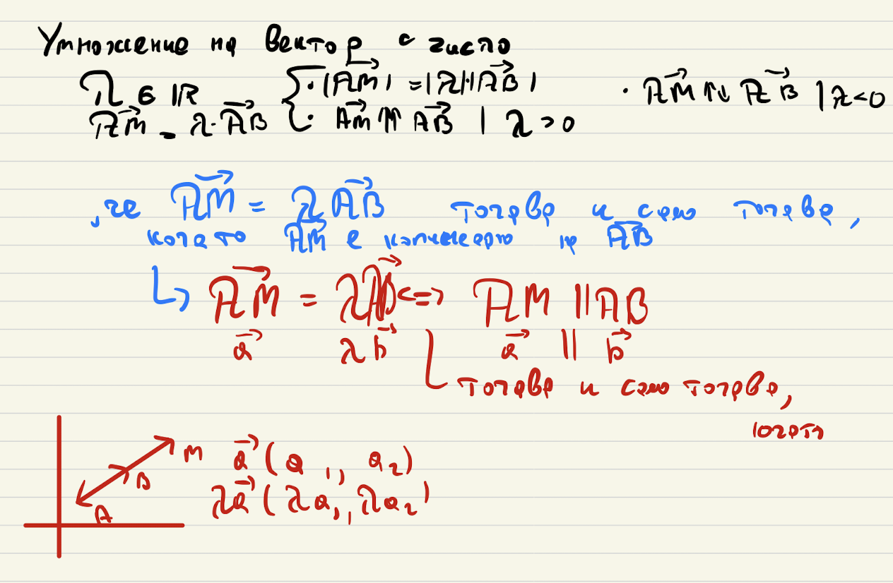
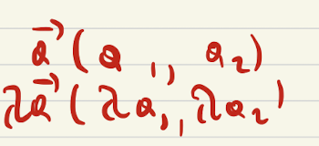
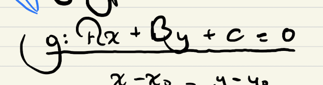
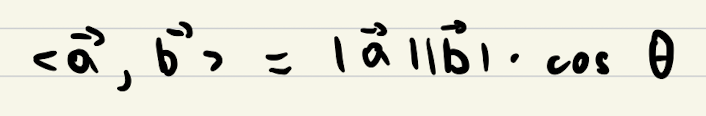

# Обяснение на двуточковите задачи
## vector.cpp
### bool is_colinear(const Vector& other)
Тази функция проверява дали два вектора са колинеарни. Първото нещо, което човек си задава "Kакво е колинеарен вектор?" - 2 вектора или съвпадат, или са успоредни. Също еднопосочните винаги са колинеарни (дотук неща от 8-ми или 9-ти клас). 



Знаейки това от тетрадката, може да стигнем до извода, че два вектора са колинеарни <=> когато единият може да се представи като произведение на другия по числото λ: 



Затова тук съм използвал следната формула:
```
a(x) / b(x) = a(y) / b(y)
```
Тъй като координатите може да са 0 и не ми се прави проверка за това, използвам кръстосано умножение:
```
a(x) * b(y) = a(y) * b(x)
```
### int area(const Vector v1, const Vector v2)
Тази функция връща площта на триъгълника, чиито страни са двата вектора. Следователно третата страна (c) е сборът на подадените вектори. 
```
double c = (v1.sum(v2)).length();
```
За да получа дължините на всяка страна, използвам функцията length(), която я имплементирах по-нагоре във файла.
```
double a = v1.length();
double b = v2.length();
double c = (v1.sum(v2)).length();
```
След това използвам Хероновата формула, за да намеря лицето на триъгълника чрез неговия полупериметър.
```
double p = (a + b + c) / 2.0; // p е полупериметъра

return sqrt(p * (p - a) * (p - b) * (p - c)); // Херонова формула
```
## line.cpp
### Line(const Point p1, const Point p2)
Тази функция (конструктор) създава линия, която минава през две точки. По Ваш съвет използвам подобно на миналия конструктор - вектор. Само че този път не е подаден, а го инстанцирам с подадените две точки, тъй като знаем, че права може да бъде описана чрез точка и вектор.
```
Vector v(p1, p2);
```
И след това правя същото както в предишния конструктор. Т.е. използвам вектор и една от подадените точки, за да опиша правата.
```
a = v.get_y();
b = -v.get_x();
c = p1.get_x() * v.get_y() - p1.get_y() * v.get_x();
```
### bool are_parallel(const Line& other)
Тази функция проверява дали две прави са успоредни (паралелни една с друга). Ако са, то техните колинеарни вектори също ще са такива. Но вместо да създавам нов вектор правя сравнение, като описаното във функцията is_colinea() - (тъй като, както обясних малко по-нагоре, колинеарни <=> успоредни (или съвпадащи)). 



От тетрадката може да видим общото уравнение за права. И знаем, че две прави са успоредни (паралелни) <=> когато техните наклони (-А / В) са равни.

Като първоначало сравнението (което е проверка за равенство) изглежда:
```
-a1 / b1 = -a2 / b2
```

и чрез кръстосено умножени (и премахване на минусите от двете страни) се получава:

```
return (this->A * other.B == this->B * other.A);
```

### bool is_orthogonal(const Line& other)
Тази функция проверява дали две прави са ортогонални (перпендикулярни една на друга). Ако векторът, описващ дадена права, е перпендикулярен на вектора, описващ друга права, то двете прави ще са ортогонални. Знаем, че скаларното умножение на вектор и неговия ортогонален е 0, тъй като ъгълът между двата вектора е равен на 90 градуса, по следната формула за скаларно умножение: 



И като се замести се получава:

```
<v1, v2> = |v1| * |v2| * cos(90) = 0
```

Ако векторите v1 и v2 са съответно ```(A1; B1)``` и ```(A2; B2)```, то скаларното им произведение е ```A1 * A2 + B1 * B2 = 0.```, и тъй като са ортогонални, следва, че двете прави са перпендикулярни само когато е изпълнено следното условие:

```
(A1 * A2) + (B1 * B2) = 0.  --скобите не са нужни, а са с изцяло стилистична цел
```

Или както е представено в кода:

```
return (((this->A * other.A) + (this->B * other.B)) == 0);
```